# Crossplane Build Check Action

[](https://github.com/yourusername/crossplane-build-check-action/actions/workflows/test.yml)

A GitHub Action that automatically validates Crossplane XRD (CompositeResourceDefinition) and Composition files in pull requests using the Crossplane CLI's `beta validate` command.

## ✨ Features

- 🔍 **Smart Change Detection** - Only validates files that changed in your PR
- ⚡ **Fast Validation** - Uses Crossplane CLI's offline validation (no cluster required)
- 📦 **Schema Caching** - Caches provider schemas for faster subsequent runs
- 🎯 **Precise Error Detection** - Catches unknown fields and schema violations
- 📊 **Rich Reporting** - Provides detailed validation summaries in GitHub Actions
- 🛠️ **Flexible Configuration** - Customize validation behavior with inputs

## 🚀 Quick Start

Add this to your workflow file (e.g., `.github/workflows/validate-crossplane.yml`):

```yaml
name: Validate Crossplane

on:
  pull_request:
    paths:
      - '**.yaml'
      - '**.yml'

jobs:
  validate:
    name: Validate Crossplane Files
    runs-on: ubuntu-latest
    
    steps:
      - name: Checkout code
        uses: actions/checkout@v4
        with:
          fetch-depth: 0  # Required for proper diff detection
      
      - name: Validate Crossplane Files
        uses: yourusername/crossplane-build-check-action@v1
        with:
          fail-on-error: true
```

That's it! The action will automatically:
1. Detect which Crossplane files changed in your PR
2. Install the Crossplane CLI
3. Validate the changed files against their schemas
4. Report any validation errors

## 📖 Usage

### Basic Usage

```yaml
- uses: yourusername/crossplane-build-check-action@v1
```

### Advanced Usage

```yaml
- uses: yourusername/crossplane-build-check-action@v1
  with:
    # Base branch for comparison (default: target branch of PR)
    base-ref: main
    
    # Don't fail the workflow on validation errors, just report them
    fail-on-error: false
    
    # Custom cache directory
    cache-dir: .crossplane/cache
    
    # Force clean the cache
    clean-cache: true
    
    # Custom working directory
    working-directory: ./infrastructure
```

### Using Outputs

```yaml
- name: Validate Crossplane Files
  id: validate
  uses: yourusername/crossplane-build-check-action@v1

- name: Use validation results
  run: |
    echo "Changed files: ${{ steps.validate.outputs.changed-files-count }}"
    echo "Passed: ${{ steps.validate.outputs.success-count }}"
    echo "Failed: ${{ steps.validate.outputs.failure-count }}"
    echo "Result: ${{ steps.validate.outputs.validation-result }}"
```

## 🔧 Inputs

| Input | Description | Required | Default |
|-------|-------------|----------|---------|
| `base-ref` | Base branch for diff comparison | No | `${{ github.base_ref }}` |
| `head-ref` | Head branch for diff comparison | No | `${{ github.head_ref }}` |
| `fail-on-error` | Fail workflow on validation errors | No | `true` |
| `cache-dir` | Directory for caching provider schemas | No | `.crossplane/cache` |
| `clean-cache` | Force clean cache before validation | No | `false` |
| `file-patterns` | Custom glob patterns for files | No | _(auto-detect)_ |
| `working-directory` | Working directory for the action | No | `.` |

## 📤 Outputs

| Output | Description |
|--------|-------------|
| `validated-files` | JSON array of validated files |
| `validation-result` | Summary of validation results |
| `changed-files-count` | Number of changed Crossplane files |
| `success-count` | Number of files that passed validation |
| `failure-count` | Number of files that failed validation |

## 🎯 What Gets Validated?

The action automatically detects and validates:

- **XRDs** (`kind: CompositeResourceDefinition`)
- **Compositions** (`kind: Composition`)
- **Provider Configs** (`kind: Provider`) - for schema resolution

Files are detected by:
1. Running `git diff` to find changed YAML files
2. Parsing each file to check the `kind` field
3. Only validating Crossplane-related resources

## 💡 How It Works

```mermaid
graph LR
    A[PR Created] --> B[Checkout Code]
    B --> C[Install Crossplane CLI]
    C --> D[Detect Changed Files]
    D --> E{Crossplane Files Changed?}
    E -->|Yes| F[Run Validation]
    E -->|No| G[Skip Validation]
    F --> H{Validation Passed?}
    H -->|Yes| I[✅ Success]
    H -->|No| J[❌ Fail]
```



The action uses the Crossplane CLI's `beta validate` command which:
- Validates resources against Kubernetes API validation
- Checks for unknown fields (common source of bugs)
- Downloads and caches provider CRD schemas
- Works completely offline (no cluster required)

## 🔍 Example Validation Output

When validation succeeds:
```
✅ All 3 file(s) validated successfully

Successfully Validated Files:
- xnetworks.example.crossplane.io
- network-aws
- provider-aws-ec2
```

When validation fails:
```
❌ 1 file(s) failed validation, 2 passed

Validation Errors:
- schema validation error: spec.unknownField: Forbidden: must be empty
- Invalid patch type: InvalidPatchType
```

## 📁 Repository Structure

If you have Crossplane files in a specific directory:

```yaml
- uses: yourusername/crossplane-build-check-action@v1
  with:
    working-directory: ./crossplane-configs
```

## ⚙️ Performance & Caching

The action caches provider schemas in `.crossplane/cache` by default. This means:
- **First run**: Downloads provider schemas (~10-30s depending on providers)
- **Subsequent runs**: Uses cached schemas (~2-5s)

To clear the cache:
```yaml
with:
  clean-cache: true
```

Or add `.crossplane/` to your `.gitignore`:
```gitignore
.crossplane/
```

## 🐛 Troubleshooting

### No files detected

**Problem**: Action reports "No Crossplane files changed"

**Solutions**:
1. Ensure `fetch-depth: 0` in checkout step
2. Check that your files have `kind: Composition` or `kind: CompositeResourceDefinition`
3. Verify files are YAML (`.yaml` or `.yml` extension)

### Validation fails with "missing schemas"

**Problem**: Cannot find provider schemas

**Solutions**:
1. Add a `Provider` resource to your repository (see `examples/sample-provider.yaml`)
2. Ensure the provider package version in your Provider resource exists
3. Try with `clean-cache: true` to refresh schemas

### Action fails on fork PRs

**Problem**: Action doesn't work on PRs from forks

**Solution**: This is expected for security. Fork PRs run with read-only tokens. Consider:
- Running on push to main after merge
- Using `pull_request_target` (with caution)

## 🔗 Related Resources

- [Crossplane Documentation](https://docs.crossplane.io/)
- [Crossplane CLI Reference](https://docs.crossplane.io/latest/cli/command-reference/#beta-validate)
- [Composition Testing Patterns](https://blog.upbound.io/composition-testing-patterns-rendering)